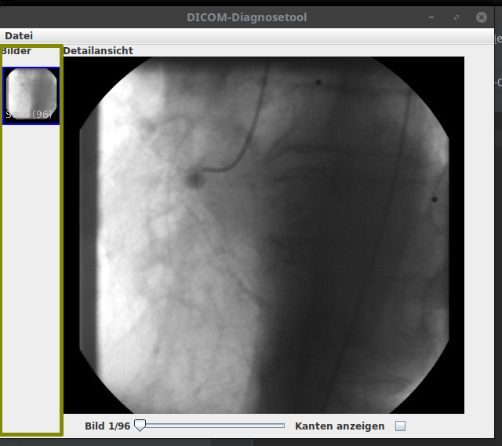

# DICOM-processing

Digital Imaging and Communications in Medicine (DICOM) is the standard for the communication and management of medical imaging information and related data.This project builds a viewer and editor for DICOM images using Java Swing. It uses Sobel operator for edge detection of DICOM images. It also supports tagging of DICOM images.

